# Brainrot Academy

A full-stack LMS built with React, FastAPI, and MongoDB — basically a course platform with a bit of a community layer bolted on, so learning doesn't feel like a chore.

The idea started from a pretty simple frustration: most LMS platforms feel sterile. Brainrot Academy tries to keep the actual learning tools solid (courses, progress tracking, dashboards) while adding a lightweight social space where students can post memes and keep up with trending slang. Education first, but it doesn't have to feel like a textbook.

## Live Demo

- Frontend: https://brainrot-academy-theta.vercel.app
- Backend API: https://brainrot-academy.onrender.com

## Features

**Auth**
Login for students, instructors, and admins, with JWT-based sessions, protected routes, and role-based access control.

**Student side**
Browse and enroll in courses, track progress, check a personal dashboard, get notifications.

**Instructor side**
Create and manage courses, view a dashboard with student analytics, get notifications.

**Admin side**
A dashboard with analytics, user management, and course management tools.

**Community**
A feed for memes and trending slang, with likes and comments.

**Responsive**
Works across desktop, tablet, and mobile.

## Screenshots

### Homepage
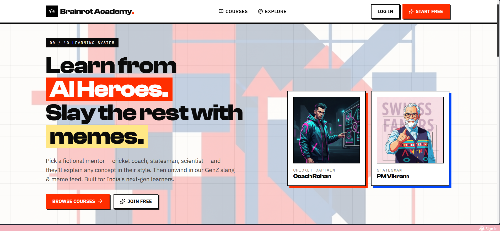
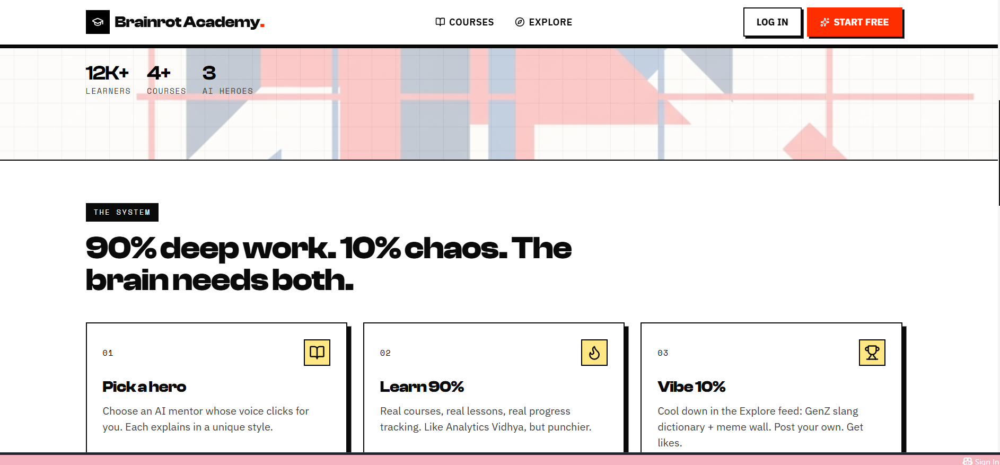
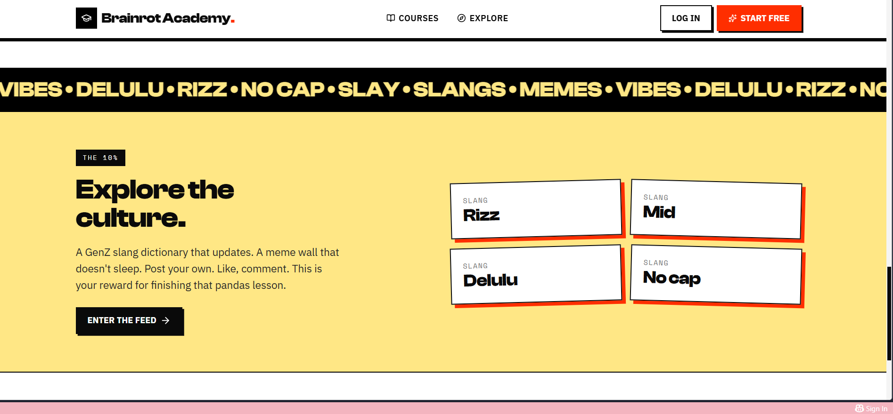

### Authentication
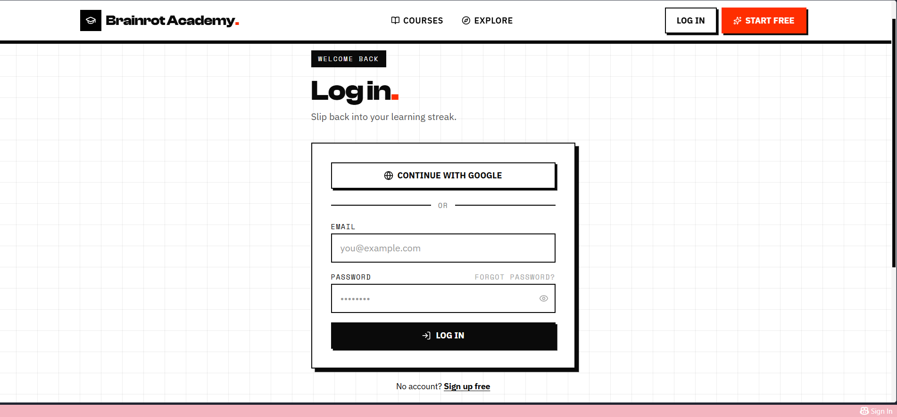
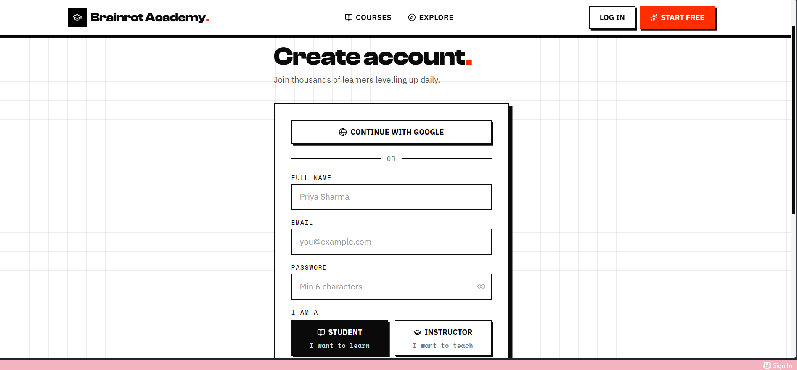

### Student Dashboard
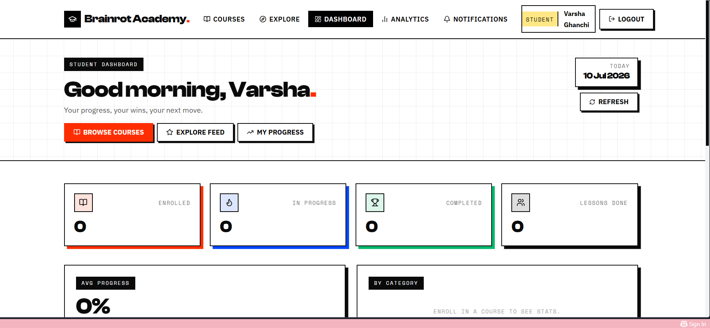
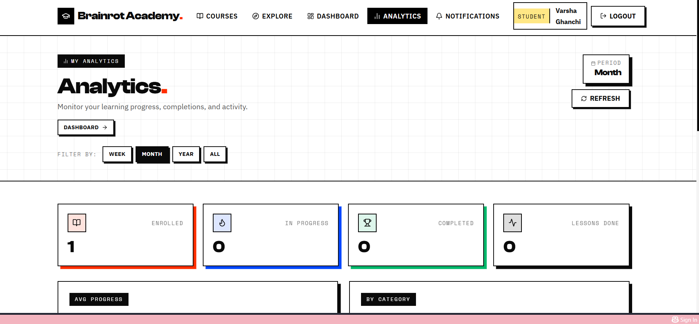
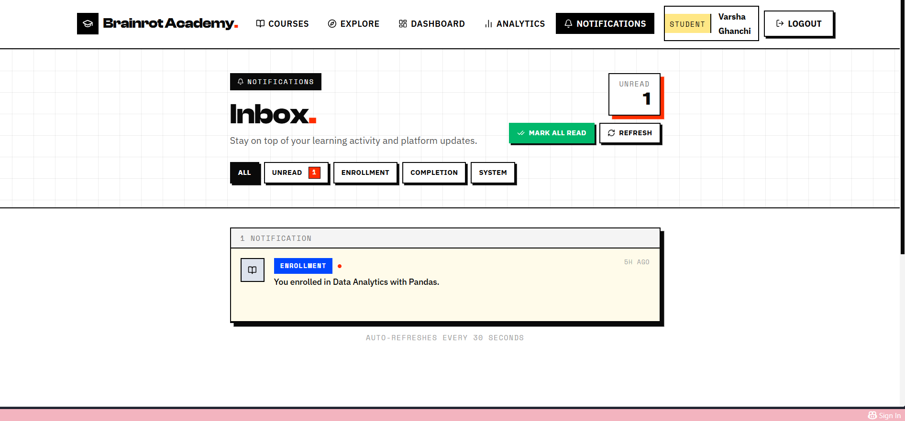

### Instructor Dashboard
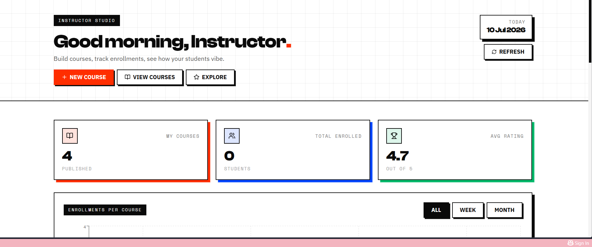
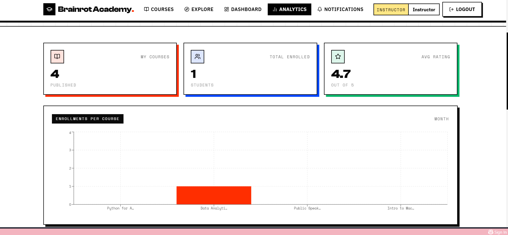
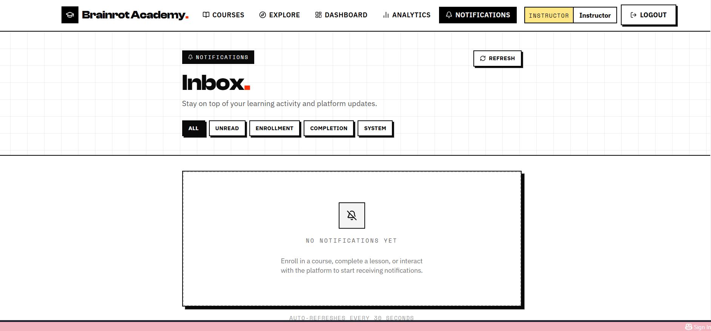

### Admin Panel
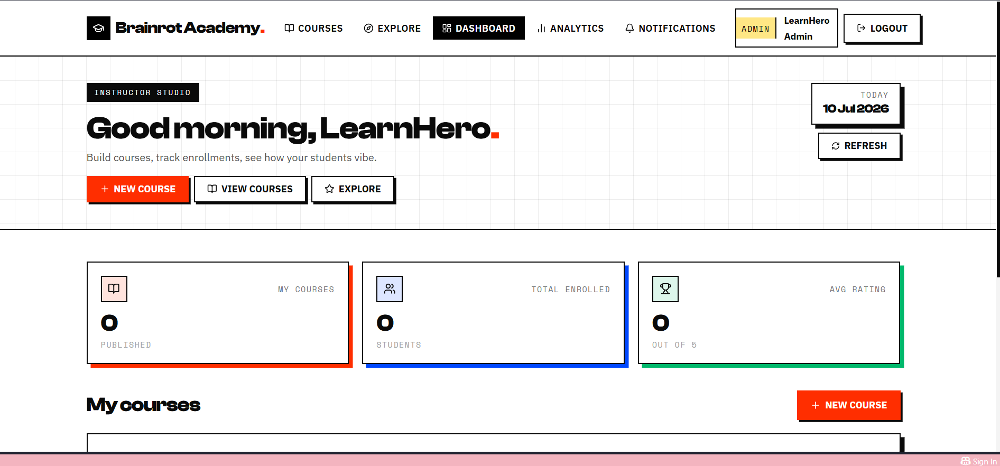
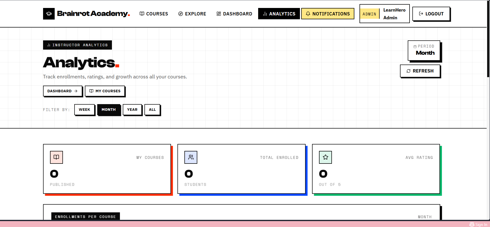
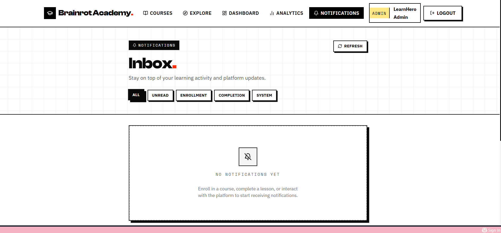
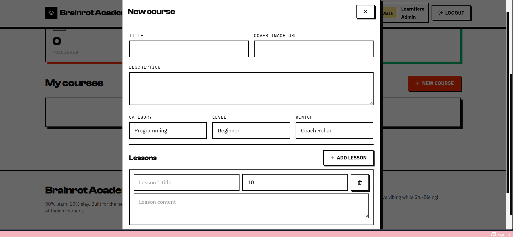

### Courses
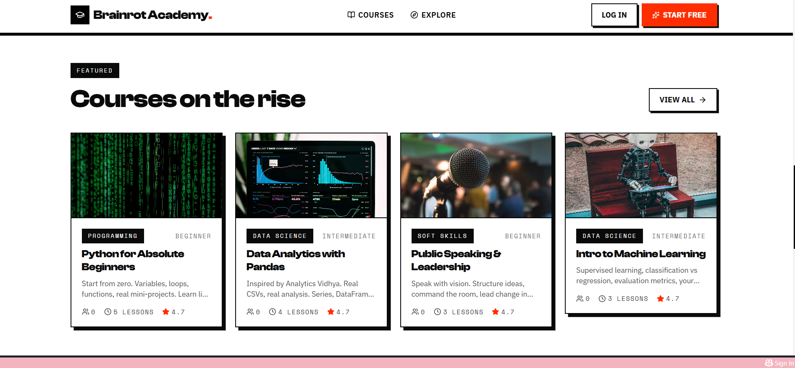

### Explore
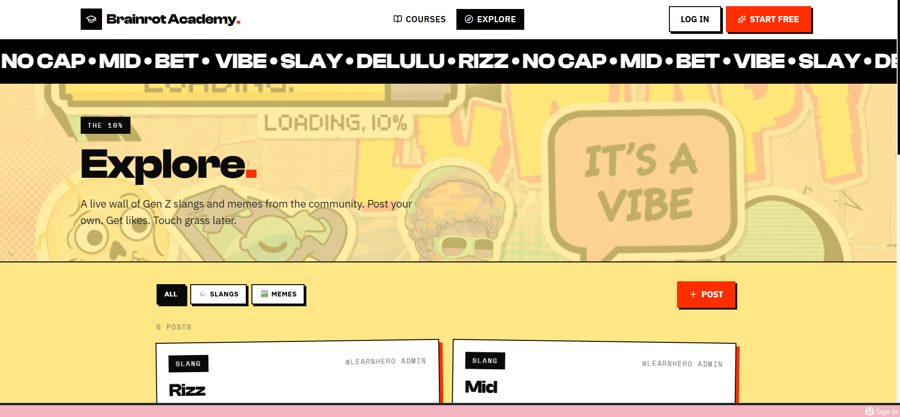

## Tech Stack

**Frontend:** React, Vite, Tailwind CSS, React Router, Axios, Recharts, Lucide React

**Backend:** FastAPI, Motor, Pydantic, JWT auth, bcrypt

**Database:** MongoDB Atlas

**Deployed on:** Vercel (frontend) and Render (backend)

## Architecture

Nothing fancy — a React frontend talks to a FastAPI backend, which reads and writes to MongoDB Atlas.

```
React Frontend → FastAPI Backend → MongoDB Atlas
```

## Project Structure

```
brainrot-academy/
├── backend/
├── frontend/
├── screenshots/
├── README.md
└── .gitignore
```

## Getting Started

Clone the repo:

```bash
git clone https://github.com/Varshaaaparmar/brainrot-academy.git
```

**Backend**

```bash
cd backend
python -m venv .venv
pip install -r requirements.txt
copy .env.example .env
uvicorn main:app --reload
```

**Frontend**

```bash
cd frontend
npm install
copy .env.example .env
npm run dev
```

## Environment Variables

Copy `.env.example` to `.env` and fill in the values. You'll need:

```env
MONGO_URL=
DB_NAME=
JWT_SECRET=
ADMIN_EMAIL=
ADMIN_PASSWORD=
FRONTEND_URL=
CORS_ORIGINS=
COOKIE_SECURE=
SEED_ON_STARTUP=
```

Don't commit your actual `.env` file.

## Deployment

| Service  | Platform      |
|----------|---------------|
| Frontend | Vercel        |
| Backend  | Render        |
| Database | MongoDB Atlas |

## Status

Still actively working on this one.

**Done so far:**
- Authentication
- Student portal
- Instructor portal
- Admin panel
- Dashboard UI
- Responsive layout
- Course management
- Community section

**On the roadmap:**
- Richer learning content
- Video streaming
- Assignments
- Live classes
- Certificates
- AI mentor
- Discussion forum

## Author

**Varsha Parmar**
Bachelor of Computer Applications
GitHub: https://github.com/Varshaaaparmar

## License

Built for educational and portfolio purposes.